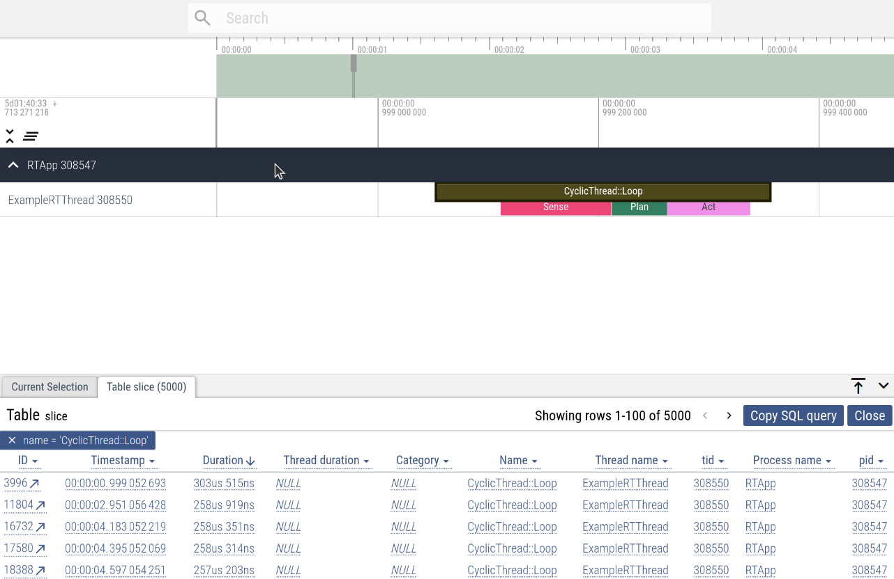
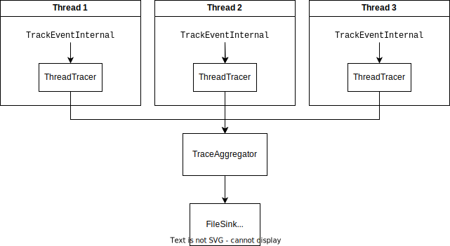
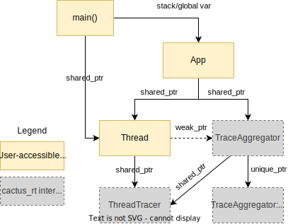

Real-time tracing
=================

Real-time applications are characterized by their ability to execute code within
a specific amount of time. To verify that the application is indeed "real-time
compliant", it is important to collect and analyze data about the timing of code
execution. This is known as [tracing][1], where information and timing about the
program execution is logged in a specialized manner such that it can be
visualized later.

[1]: https://en.wikipedia.org/wiki/Tracing_(software)

For real-time purposes, the most important data to collect is the time duration
of certain blocks of code. This information can then be visualized on a
timeline, or analyzed statistically (such as via mean, average, min, max, and
percentile analysis), to experimentally determine whether or not an application
conforms to its deadline requirements. This benchmark/validation step is very
important during the development of a real-time application.

To make things more concrete, consider an example where a loop controlling a
robot is executing in real time at 1000 Hz. Suppose the each iteration of the
loop consists of the following three sequential actions:

1. `Sense`
2. `Plan`
3. `Act`

The sum of the duration of these actions must not exceed 1 ms (as the loop is
1000 Hz). Considering other overheads (such as operating system scheduling
latency) and safety margin, a real-world design constraint may limit the sum of
the duration to maybe 0.5ms or less. It is important to collect data from
real-program execution and verify that the application timing indeed conforms to
the specification.

To accomplish this verification without a proper tracing system, one may be
tempted to write code similar to this:

```c++
void Loop() {
  auto t1 = NowNs();
  Sense();
  auto t2 = NowNs();
  Plan();
  auto t3 = NowNs();
  Act();
  auto t4 = NowNs();

  auto sense_duration = t2 - t1;
  auto plan_duration = t3 - t2;
  auto act_duration = t4 - t3;
  auto loop_duration = t4 - t1;
  CollectTiming(sense_duration, plan_duration, act_duration, loop_duration);
}
```

Since this code is supposed to execute in real-time, we have to assume that
`CollectTiming` is real-time compliant and is therefore likely to be slightly
complex (how this would be done is left as an exercise for the reader). After
the timing information is collected, it must be manually analyzed and visualized
(either in spreadsheets or via scripts). This is all very tedious and error
prone.

Fortunately, cactus_rt is built with a real-time-compliant tracing system where
you can instead write your code as follows (full example is [here][example]):

```c++
void Sense() {
  auto span = Tracer()->WithSpan("Sense");
  // Your custom code...
}

void Plan() {
  auto span = Tracer()->WithSpan("Plan");
  // Your custom code...
}

void Act() {
  auto span = Tracer()->WithSpan("Act");
  // Your custom code...
}

void Loop() {
  Sense();
  Plan();
  Act();
}
```

It then generates a file that can be imported into an offline (not dependent on
a remote server) Web UI where the following interactive timeline plot can be
generated:


From the same WebUI, look for all the loop iterations and order by the highest
duration:



You can even use SQL to analyze the data in the same UI. Here is an example of
selecting the minimum, average, and maximum duration for the loop iteration:


How to use
----------

See the [`tracing_example`][example] for details.

[example]: https://github.com/cactusdynamics/cactus-rt/blob/master/examples/simple_example/main.cc

Technical design
----------------

### Introduction

A proper tracing system requires three components:

1. The instrumentation API and the collection of data for the threads being
   traced;
2. The serialization and storage of trace data;
3. The visualization and analysis of trace data in terms of "spans" (also known
   as slice, which is basically a duration for a block of code).

Since `cactus_rt` is designed to help write real-time applications, the
instrumentation API and the passing of trace information from the real-time must
be real-time-compliant.

A number of open-source tracing libraries and frameworks already exists that
provide some/all of these capabilities. A number of them were evaluated for
inclusion into `cactus_rt`. Unfortunately, none of them satisfied all
requirements. My opinions on the surveyed technologies are as follows:

- [`lttng-ust`][lttng-ust] is real-time-compliant as far as I can tell, but its
  API is heavily based on C macros that is difficult to use. Trace analysis can
  be done via Trace Compass but the barrier of entry for that software is
  relatively high (have to basically install Eclipse) for it to work. Trace
  Compass is also somewhat complex and difficult to learn.
- [BPF + USDT][usdt] is not real-time-compliant, is relatively difficult to use,
  and relatively difficult to analyze.
- [Perfetto][perfetto] is not real-time-compliant (as internally it uses a mutex
  without priority inheritance), but has a reasonable API and an intuitive and
  easy-to-use web UI at https://ui.perfetto.dev or via offline static files. It
  also features an impressive SQL system that allows developers to analyze the
  collected data more efficiently.

Through the investigations, it was determined that Perfetto's trace data storage
and analysis systems are reasonably independent and [decoupled from the
instrumentation API and data collection code][synthetic-events] and is the most
usable system available. This enabled the development of a custom,
real-time-compliant instrumentation API and data collection library that outputs
Perfetto-compatible data files to be developed. The data files can then be used
in the Perfetto analysis system. A simple instrumentation API and data
collection library is thus developed to emit Perfetto-compatible data and this
is integrated in `cactus_rt`.

[synthetic-events]: https://perfetto.dev/docs/reference/synthetic-track-event

### Architecture

The overall idea is simple and similar to how
[Quill](https://github.com/odygrd/quill#design) operates, although this design
is common across a wide range of data sharing from a thread sensitive to
performance issues and is illustrated in the following diagram:



Each `Thread` holds a `ThreadTracer` object, which internally contains a [SPSC
queue](lockless-queues.md). Tracing data is sent to it via the
`TrackEventInternal` struct. These queues are read by a central, non-real-time
thread called `TraceAggregator` which then transforms the `TrackEventInternal`
objects into [Perfetto-compatible protobuf messages][perfetto-proto]. These are
then passed to `Sink` objects which can write them to files, or send them
somewhere else (such as over the network).

[perfetto-proto]: https://perfetto.dev/docs/reference/trace-packet-proto

The tracing system also allows for these things to occur:

1. Tracing can be dynamically enabled and disabled via a simple API call on the
   process-level.
2. Threads can be created and traced at any time during the program execution.
3. Threads can be stopped at anytime and not impact the tracing system.
4. Sinks can be registered at any time and the data written to these sinks only
   contains trace events emitted after the sink is registered.

#### Dynamic tracing enable/disable

To minimize performance overhead, tracing is enabled/disabled can be checked by
reading a single global atomic boolean variable. This variable controls all
traces from all threads within the process.

Upon enabling tracing via `App::StartTraceSession`, `cactus_rt` also creates and
starts the `TraceAggregator` thread.  Perfetto's file format specification
indicates that the track descriptor packets must be first written before the
actual trace event packets. Thus, after starting the `TraceAggregator`, a
[`ProcessDescriptor`](https://perfetto.dev/docs/reference/trace-packet-proto#ProcessDescriptor)
packet is first written. A
[`ThreadDescriptor`](https://perfetto.dev/docs/reference/trace-packet-proto#ThreadDescriptor)
packet is emitted for each thread that is known to the `TraceAggregator`. Then,
the main loop of the `TraceAggregator` can run which will write track event
packets to the sinks.

When tracing is disabled via `App::StopTraceSession`, the tracing enabled atomic
bool will be set to false. The system will request the `TraceAggregator` thread
to drain all data from the existing `ThreadTracers` and stop. Once this is done,
the file is closed and the `TraceAggregator` states (interned data, sequence
states) are reset so they can be launched again.

#### Dynamic thread creation

Each `Thread` owns a `ThreadTracer`. However, when a thread starts, it must
notify the `TraceAggregator` (if tracing is enabled and it exists) of its
existence and thread id so a
[`ThreadDescriptor`](https://perfetto.dev/docs/reference/trace-packet-proto#ThreadDescriptor)
packet can be written to the data stream before any trace event data is written.
If tracing is not enabled right now, the `TraceAggregator` will cache the
`ThreadTracers` so that once tracing is enabled, the `ThreadDescriptor` packet
is written out.

The `Thread` is able to communicate with the `TraceAggregator` by storing a
`weak_ptr` to the `TraceAggregator`. This pointer is setup during
`App::RegisterThread` so there's no explicit dependency between `Thread` and
`App` during construction.  This decision may be revisited in the future.

#### Ownership structure

The structure is not ideal and has some problems, but works for the most part.



#### Cleanup after thread shutdown

TODO...

### Performance and limitations

#### Too much data causing buffer overflow and trace data drops

#### String interning

Perfetto allows event names and event categories to be interned by assigning
each unique string with an id and emitting the id rather than the string to save
space in the output trace files. This feature is implemented via the
`interned_data`, `name_iid`, and `category_iids` fields. A few details worth
noting:

1. Perfetto uses `trusted_packet_sequence_id` to identify a single sequence. A
   single sequence must have monotonically increasing timestamps for its
   packets. Both Perfetto upstream and cactus-rt's implementation of the tracer
   gives a sequence id per thread. In cactus-rt, this is especially important
   as when we pop the data from the queue originating from multiple threads.
2. The `iid`s on their own are not sufficient to identify the string being
   interned as it is not "globally" unique. It is only unique per sequence
   (i.e. thus `(trusted_packet_sequence_id, iid)` is sufficient to identify an
   interned string). This, along with (1), implies we have to intern strings on
   a per-thread interner.
3. When a tracing session stop, the string interner states for all known thread
   tracers are reset. This means a subsequent session will not have the same
   string iids.

### Other notes

#### Perfetto SDK (upstream) can grab a lock when buffer is full

- It seems that trace events are emitted via the `TRACE_EVENT` macro, which starts [here with `TRACE_EVENT_BEGIN`](https://github.com/google/perfetto/blob/v43.2/include/perfetto/tracing/track_event.h#L354).
- This then calls [`PERFETTO_INTERNAL_TRACK_EVENT_WITH_METHOD`](https://github.com/google/perfetto/blob/v43.2/include/perfetto/tracing/internal/track_event_macros.h#L115).
  - This also calls `perfetto_track_event::internal::isDynamicCategory`
- This calls [`perfetto_track_event::TrackEvent::TraceForCategory`](https://github.com/google/perfetto/blob/v43.2/include/perfetto/tracing/internal/track_event_data_source.h#L376), which eventually calls:
  - [`WriteTrackEventImpl`](https://github.com/google/perfetto/blob/v43.2/include/perfetto/tracing/internal/track_event_data_source.h#L874) which creates the protobuf packet via protozero.
    - This [calls](https://github.com/google/perfetto/blob/v43.2/include/perfetto/tracing/internal/track_event_data_source.h#L901) [`TrackEventInternal::WriteEvent`](https://github.com/google/perfetto/blob/v43.2/src/tracing/internal/track_event_internal.cc#L528)
    - which [calls](https://github.com/google/perfetto/blob/v43.2/src/tracing/internal/track_event_internal.cc#L537) [`NewTracePacket`](https://github.com/google/perfetto/blob/v43.2/src/tracing/internal/track_event_internal.cc#L470)
    - which [calls](https://github.com/google/perfetto/blob/v43.2/src/tracing/internal/track_event_internal.cc#L479) [`TraceWriterBase::NewTracePacket`](https://github.com/google/perfetto/blob/v43.2/include/perfetto/tracing/trace_writer_base.h#L41-L61), **which might be [`TraceWriterImpl::NewTracePacket`](https://github.com/google/perfetto/blob/v43.2/src/tracing/core/trace_writer_impl.cc#L119).**

From the other side:

- `SharedMemoryArbiterImpl::GetNewChunk` grabs [a lock](https://github.com/google/perfetto/blob/v43.2/src/tracing/core/shared_memory_arbiter_impl.cc#L106-L110)
  - [called from](https://github.com/google/perfetto/blob/v43.2/src/tracing/core/trace_writer_impl.cc#L242) `TraceWriterImpl::GetNewBuffer`.
  - **This is called from [`TraceWriterImpl::NewTracePacket`](https://github.com/google/perfetto/blob/v43.2/src/tracing/core/trace_writer_impl.cc#L151).** This is called if the chunk is too full for the data.

This means that there is a small chance that a lock can be taken, and an even smaller chance that a priority inversion could take place. This means it is not suitable for hard real-time applications and a custom tracing library must be written.

#### Perfetto SDK string interning

- `WriteTrackEventImpl` [calls](https://github.com/google/perfetto/blob/v43.2/include/perfetto/tracing/internal/track_event_data_source.h#L907) `TrackEventInternal::WriteEventName` which calls [`InternedEventName::Get`](https://github.com/google/perfetto/blob/v43.2/src/tracing/internal/track_event_internal.cc#L506), and which is implemented in [here](https://github.com/google/perfetto/blob/v43.2/include/perfetto/tracing/track_event_interned_data_index.h#L183).
  - In here there's memory allocation due to [`LookupAndInsert`](https://github.com/google/perfetto/blob/v43.2/include/perfetto/tracing/track_event_interned_data_index.h#L99-L144) (called from [here](https://github.com/google/perfetto/blob/v43.2/include/perfetto/tracing/track_event_interned_data_index.h#L189)) using a `std::map`.
  - Also `GetOrCreateIndex` [calls `new`](https://github.com/google/perfetto/blob/v43.2/include/perfetto/tracing/track_event_interned_data_index.h#L243). Likely this means another allocation potential on the hot path.

This means Perfetto uses memory allocation on the hot path, which is not acceptable for cactus-rt due to real-time constraints.

#### Perfetto SDK data dropping counter

Advanced tuning and use cases
-----------------------------

One problem with passing tracing data from a SPSC queue is that sometimes the
queue can get full. To be real-time-compliant, the SPSC queue within the
`ThreadTracer`s are statically allocated and do not expand when it is full. This
means trace data can be lost when the volume of trace events is too large.

TODO...

