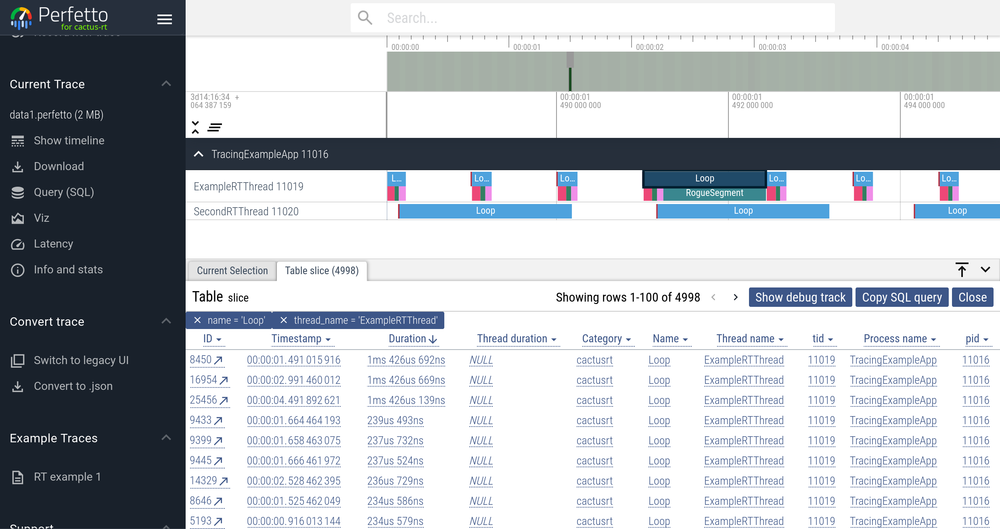
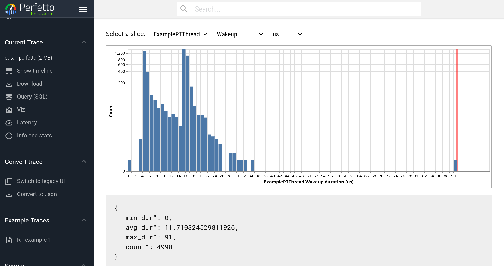

`tracing_example`
=================

Designed to show off how to trace a real-time application with the
real-time-safe tracing system.

Features demonstrated:

1. Enable and disable tracing dynamically.
2. Trace custom code in your application with spans.
3. Setting the output file location.

To run this:

```bash
$ make debug
$ sudo build/debug/examples/tracing_example/rt_tracing_example
```

To visualize the trace, go to https://cactusdynamics.github.io/perfetto (or
https://ui.perfetto.dev which doesn't have as much bells and whistles) and load
the trace in `build/data1.perfetto` and `build/data2.perfetto`.

You should be able to see something like this:


By clicking on the `Loop` slice, filtering and sorting with the table that pops
up, then clicking on the ID of the longest `Loop` in the table will bring you to
the following view:



Clicking on the _Latency_ tab on the side bar and selecting the right span will
get you something like the following:


